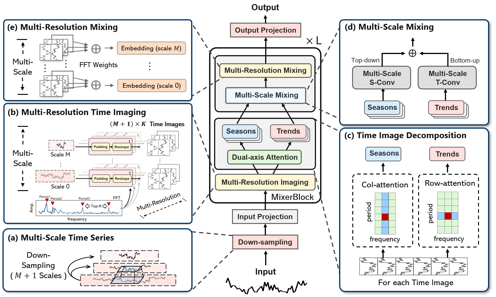
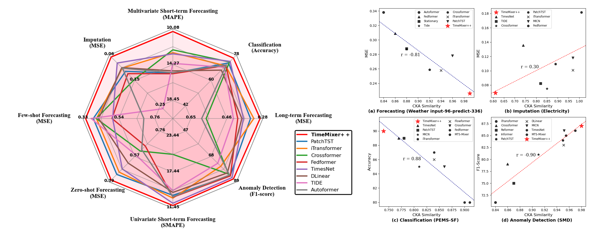

## Overview
To help reviewers verify and run our experiments, we are providing:
- Trained model checkpoints for TimeMixer++.
- Python code to load the checkpoints and run the evaluations on benchmark datasets.

We offer a quick demo to help you easily get acquainted with our work and run our experiments.

## Provided Files

1. **Model Checkpoints**: The trained model checkpoints should be downloaded from [Google Drive](https://drive.google.com/file/d/1pnF1noC67FP2DzXfY_UD93JmGI9beNRW/view?usp=drive_link) and placed in the `./ckpts` directory before running our experiments.
2. **Results**: The detailed results are available in `result_long_term_forecast.txt`.
3. **Reproduction**: Commands to load the checkpoints and reproduce the experimental results from the paper are provided.
4. **Datasets**: Please download the dataset from [Google Drive](https://drive.google.com/drive/folders/1wyJrXPh1pSRDYC_fC2Zxrsv3udYKVRJl?usp=sharing) and place it in the `./dataset` directory.


**Framework Overview of TimeMixer++.**


**Benchmarking model performance and representation analysis in
four tasks.**


# Quick Demo
Run the following command to execute the experiment tasks.

**Example: ETTh1 Long-term Forecasting** 
```shell
python run.py \
  --task_name long_term_forecast \
  --root_path  ./dataset/ETT-small/\
  --data_path ETTh1.csv \
  --test_data_path ETTh1.csv \
  --model_id ETTh1_96_96 \
  --model TimeMixerPP \
  --data ETTh1 \
  --features M \
  --seq_len 96 \
  --label_len 0 \
  --pred_len 96 \
  --e_layers 2 \
  --enc_in 7 \
  --c_out 7 \
  --des 'Exp' \
  --d_model 16 \
  --d_ff 64 \
  --down_sampling_layers 3 \
  --down_sampling_method conv \
  --down_sampling_window 2
```

**Other Experiments** 

For additional scripts covering different datasets and configurations, refer to:
```shell
./scripts
```
